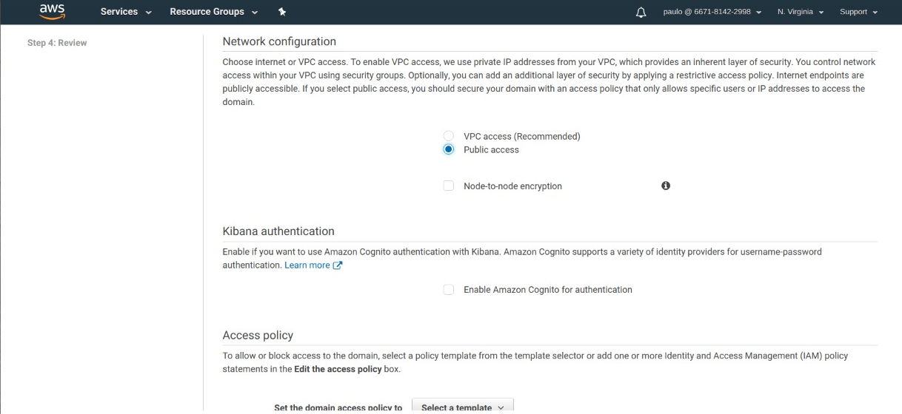

# Tutorial: Como transferir dados para o Elasticsearch AWS
## Projeto Final da disciplina de Megadados
#### Insper 2018.2
Isabella Oliveira  
Lucas Chen  
Paulo Tozzo  

  Neste tutorial você vai aprender a transferir grandes quantidades de dados (bigdata), de diversos tipos diferentes, para o Elasticsearch da Amazon AWS. Essa é uma tarefa útil, por exemplo, quando você quiser analisar as reviews de um site de vendas com escala global, ou então quando você quer fazer diversas buscas em uma grande base de dados.
Para começar, é necessário criar um bucket com os arquvios que você deseja usar e subir um cluster na Amazon AWS. Este cluster precisa ter duas dependências adicionais do que as comuns do spark que são a requests e a requests_aws4auth e você pode baixar o nosso sh com elas inclusas neste mesmo repositório. Ele servirá para "pegar" o arquivo do seu bucket e passar para o Elasticsearch por meio de um pipeline.

 ### Criando um domínio com o Elasticsearch Service
 
  As configurações default de criação de um domínio do Elasticsearch já são as necessárias para sua utilização e apenas alguns detalhes precisarão ser configurados:
  1. Configurar a política de acesso da sua instância. Algumas opções para isso são: 
  
  
  - Você pode utilizar o template da AWS e adicionar a sua identificação de usuário. Neste caso, quando algum usuário autorizado excutar nosso código, esta ação será assinada por nós mesmos e isso permitirá que tudo seja executado com sucesso. O contra desta opção é que normalmente não será possível acessar nem o endpoint nem o Kibana, para acessá-los será necessário utilizar outro serviço (que não foi utilizado por nós) chama Cognito.
  - Você também liberar certos IP's públicos para terem acesso ao seu domínio. O contra desta opção é que será necessário autorizar cada instância do seu cluster, além do seu próprio computador para ter acesso ao Kibana.
  - Você pode liberar o acesso para todos com o open access, mas o contra desta opção é que qualquer pessoa que encontrar o seu domínio pode acessá-lo, acessar o Kibana, adicionar dados e etc.
  
  2. Configurar a seção Network configuration como 'public access'. 
  
  
### Como alimentar o seu domínio

  No dashboard do Elasticsearch haverá dois links para você acessar. O primeiro redirecionará para o endpoint do domínio e o segundo para o Kibana. 
  
  Será necessário alterar três partes do código para poder utiliza-lo:
  - Trocar o endpoint que está lá para o seu pela variável "endpoint".
  - Alterar a variável "index" se quiser, pois ela será o index pattern do Kibana.
  - Alterar a especificação do bucket do qual será retirado os dados. A variável "df" define um arquivo do bucket e será ele que alimentará o Kibana. 
  
  E está pronto.
